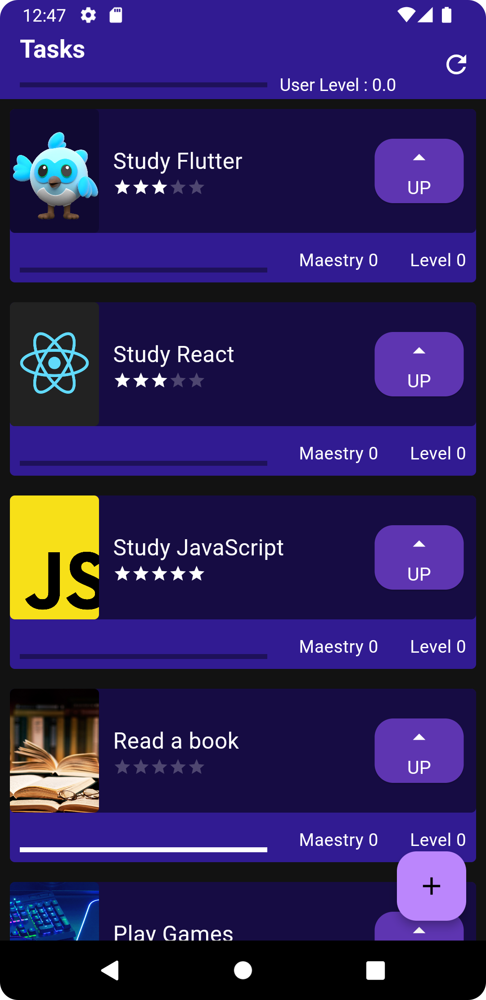
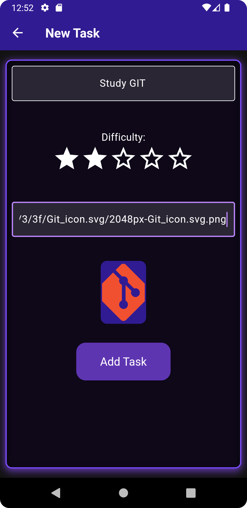
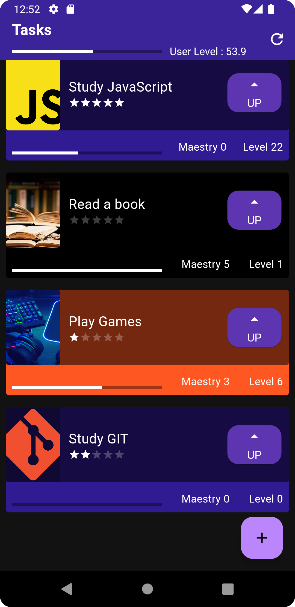

# Task App built with Flutter

A Task Manager that you can create tasks, set a difficulty, and level up in each of them to track you progress.

##

<h3>Home Page</h3>

##

<h3>Creating Task</h3>

